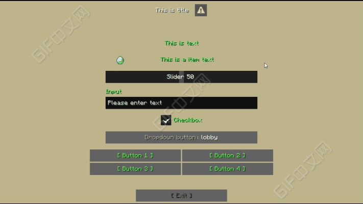

# KaMenu

[](LICENSE)
[](https://adoptium.net/)
[](https://www.spigotmc.org/resources/133736/)

KaMenu is a YAML-based native Minecraft Dialog menu plugin. It provides body components, forms, button layouts, conditions, action workflows, periodic tasks, persistent storage, dynamic lists, JavaScript packages, custom commands, and an API for other plugins.



## Requirements

- Java 21 or newer
- Spigot 1.21.6+, or Paper/Folia 1.21.7+
- Internet access during the first startup to download runtime libraries

SQLite is used by default. MySQL 5.7+ is also supported.

## Documentation

- [English documentation](docs-en/README.md)
- [简体中文文档](docs/README.md)
- [English Wiki](https://katacr.gitbook.io/plugins/kamenu-en)
- [SpigotMC resource](https://www.spigotmc.org/resources/133736/)

Run `/kamenu guide` after installation to open the built-in setup guide and release the example menus.

## Building

The project includes the Gradle wrapper and targets Java 21:

```bash
./gradlew clean shadowJar
```

The plugin JAR is generated under `build/libs/`.

## Optional Integrations

- PlaceholderAPI
- Vault
- ItemsAdder
- Oraxen
- CraftEngine

These integrations are soft dependencies and are not required for KaMenu to start.

## Support

- [GitHub Issues](https://github.com/Katacr/KaMenu/issues)
- [Discord](https://discord.gg/HvKQD2us2F)

When reporting a problem, include the server software and version, KaMenu version, related menu YAML, and the complete stack trace.

## License

Copyright (C) 2026 Katacr.

KaMenu is free software licensed under the [GNU General Public License v3.0](LICENSE). You may use, study, modify, and redistribute it under the terms of that license. Modified or redistributed versions must preserve the same license obligations, including corresponding source availability where required by GPL-3.0.
